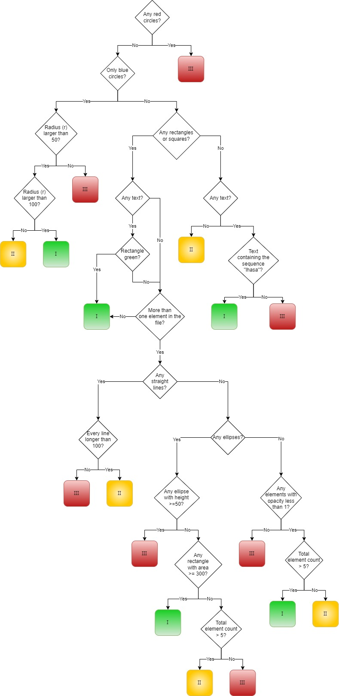

# Simple Scientific Classification Kata

This is a simplified version of the [Scientific Classification work flow Kata from Lhasa](https://github.com/jmaes12345/lhasa-kata).

It is based on the same [Cramer classification](https://doi.org/10.1016/S0015-6264(76)80522-6) decision tree work flow used to categorise the risk of a chemical to human safety.

However, instead of using SVG files to represent the structure of the chemicals being analysed, we skip this step and represent them as a code construct.
This allow us to focus on creation a decision tree that output the correct toxicity risk for a given chemical structure.

## Instruction

All chemicals are made up of atoms or groups of atoms, which we call “functional groups”, and it is the presence, type, combination, and arrangement of atoms that 
ultimately results in the risk to humans and animals.

We can approximate the chemicals and their attributes to a collection of shapes and objects (atoms) grouped together (functional groups).

For the purposes of this kata a chemical can consist of one or more functional groups.
A functional group may be:

- A circle
- A rectangle
- Some text
- An ellipse
- A line

Given a chemical, determine the risk to human safety by implementing the following decision tree:

